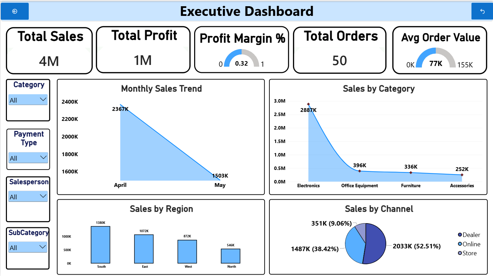

# Executive Sales Dashboard (Power BI)

## 📌 Project Overview
Designed and deployed an end-to-end interactive dashboard translating business requirements into intuitive KPI scorecards for executive monitoring.

## 🛠️ Tools & Technologies Used
* **Power BI**: Data modeling, dynamic KPI cards, interactive visuals
* **DAX**: Custom measures, calculated columns, trend analysis
* **Microsoft Excel**: Data source preparation, cleaning, and validation

## 📊 Key Highlights & Metrics
* **Executive Scorecards**: Tracked core performance metrics including Total Revenue, Profit Margins, and Cost.
* **Trend Analysis**: Visualized monthly and regional sales patterns to uncover growth opportunities.
* **Product Performance**: Segmented top-performing categories and items to support strategic planning.

## 📁 Repository Contents
* `Executive_Sales_Dashboard.pbix` — Complete interactive Power BI file
* `Sales_Data.xlsx` — Source dataset

## 📊 Dashboard Preview

